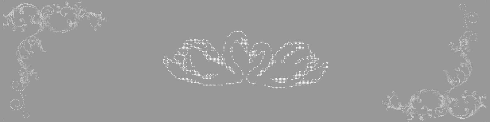

</h1>

<h3 align="center">Estudiante de Ingeniería Industrial</h3>
<h3 align="center">Data Science aplicada a procesos industriales</h3>

 

### 🔧 Sobre mí

- 🎓 Estudiante de Ingeniería Industrial y Electromecánica
- 🤖 Actualmente cursando un programa en **IA Generativa, Machine Learning, NLP y Ciencia de Datos**
- 📊 Construyendo mi perfil en **Ciencia de Datos**, con foco en aplicarla a problemas reales de industria: mantenimiento predictivo, control de calidad y optimización de procesos-

  

 

  

<!-- BANNER PRINCIPAL: Este sí queda al 100% para dar la bienvenida -->

<h3 align="center">Estudiante de Ingeniería Industrial | Data Science aplicada a procesos industriales</h3>

  <!-- Este tag da un pequeño salto de línea para dar "aire" -->

### 🔧 Sobre mí

* 🎓 Estudiante de Ingeniería Industrial y Electromecánica.
* 🤖 Actualmente cursando un programa en **IA Generativa, Machine Learning, NLP y Ciencia de Datos**.
* 📊 Construyendo mi perfil en **Ciencia de Datos**, con foco en aplicarla a problemas reales de industria: mantenimiento predictivo, control de calidad y optimización de procesos.

### 💻 Tecnologías y Herramientas
<!-- Aquí agregamos los badges para darle vida. Puedes cambiar los nombres luego -->

  
  
  

 

<!-- GRÁFICO: Reducimos un poco su ancho (80%) y lo centramos -->

  

<!-- BANNER DE CIERRE: Más pequeño, a modo de "firma" elegante -->

  

